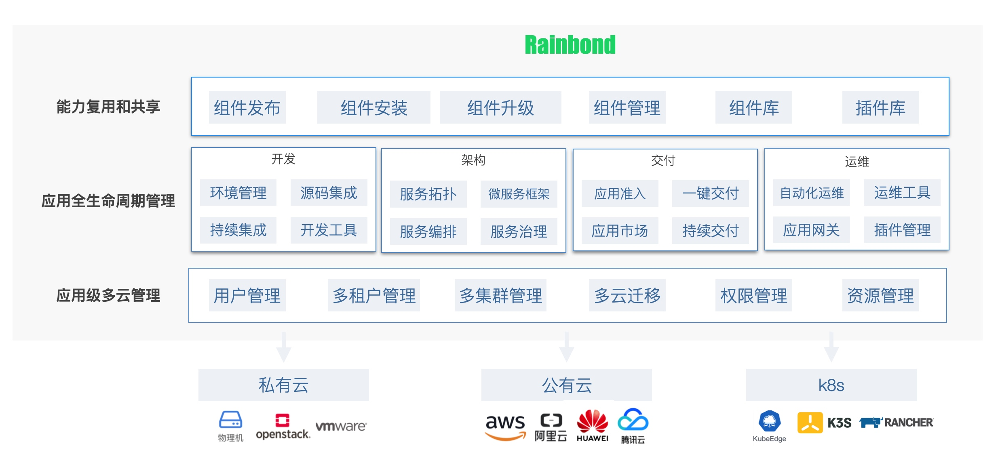

<div align="center">
  

  [](README.md)
  [](https://github.com/goodrain/rainbond/stargazers)
  
  [](https://godoc.org/github.com/goodrain/rainbond)

  <h3>不用懂 Kubernetes 的云原生应用管理平台</h3>

  [项目官网](https://www.rainbond.com?channel=github) • [文档](https://www.rainbond.com/docs?channel=github)
</div>

## Rainbond 是什么

Rainbond 核心100%开源，Serverless体验，不需要懂 Kubernetes 也能轻松管理容器化应用，平滑无缝过渡到 Kubernetes，是国内首个支持国产化信创、适合私有部署的一体化应用管理平台。

### 亮点

- **不用写 Dockerfile 和 Yaml:**  平台支持自动识别多种开发语言，如 Java、Python、Golang、NodeJS、Php、.NetCore 等，通过向导式流程完成构建和部署，不用写 Dockerfile 和 Yaml 即可完成构建和运行。

- **模块化拼装:**  在 Rainbond 上运行的业务组件支持一键发布为可复用的应用模版，统一的组件库存储，通过业务组件积木式拼装，实现业务组件的积累和复用。

- **应用一键安装和升级:** 上百应用开箱即用、各类已发布的微服务应用模版，均支持一键安装和升级。

- **丰富的可观测性:** Rainbond 提供全面的可观测性，涵盖集群监控、节点监控、应用监控、组件监控。

- **应用全生命周期管理:**  Serverless体验，支持应用、组件全生命周期管理和运维，如启动、停止、构建、更新、自动伸缩、网关策略管理等，无侵入微服务架构。

### 体验

1. **代码无需改动，就能变成云原生应用:**  对于新业务或已有业务，代码不需要改动就能将其容器化。不需要懂Docker 、Kubernetes等技术，就能将应用部署起来，具备云原生应用的全部特性。

2. **普通开发者不需要学习就能实现应用运维:**  通过应用级抽象，普通开发者了解应用的相关属性就能实现应用运维，并通过插件扩展监控、性能分析、日志、安全等运维能力，应用运维不再需要专用的SRE。

3. **像安装手机App一样安装云原生应用:**  各类云原生应用以应用模版的形式存放到应用市场，当对接各种基础设施或云资源，实现应用即点即用或一键安装/升级。

4. **复杂应用一键交付客户环境:**  复杂应用发布成应用模版，当客户环境可以联网，对接客户环境一键安装运行，当客户环境不能联网，导出离线应用模版，到客户环境导入并一键安装运行。

## 架构



Rainbond 底层可以对接各类私有云、公有云、Kubernetes 等基础设施，在基础设施之上，支持了用户管理、多租户、多集群管理、多云迁移等，以应用为中心分配和管理资源，实现了应用级多云管理。

对于开发者而言，不需要关注底层资源和概念。Rainbond 提供了一个开箱即用的平台，支持管理应用的全生命周期，包括开发、架构、交付和运维等阶段。

同时 Rainbond 对应用整体进行了包装和抽象，定义出了应用抽象模型。该模型包含应用运行所需的全部运行定义，与底层技术和概念隔离。开发者可以基于该模型实现能力的复用和共享，如组件一键发布、安装、升级等。

有关 Rainbond 架构的更多详细信息，请参阅 [Rainbond设计思想](https://www.rainbond.com/docs/quick-start/architecture/design-concept)。

## 快速开始

### 安装

仅需执行以下命令，运行起来一个容器。即可快速体验到 Rainbond 完整功能。更多安装方式参考[安装与升级](https://www.rainbond.com/docs/installation/)。

```bash
curl -o install.sh https://get.rainbond.com && bash ./install.sh
```

当命令执行成功后，打开浏览器，输入 `http://<IP>:7070` ，即可访问平台开始部署应用了。`<IP>`为执行脚本时你选择或者输入的 IP。

### 快速入门

请参考文档 [快速入门](https://www.rainbond.com/docs/quick-start/getting-started/?channel=github) 。

## 开源社区

如果你在使用 Rainbond 过程中遇到问题需要帮助，请参阅 [社区支持](https://www.rainbond.com/community/support/)。

或添加微信小助手加入 Rainbond 技术交流群:


Slack: [Rainbond Slack 频道](https://join.slack.com/t/rainbond-slack/shared_invite/zt-1ft4g75pg-KJ0h_IAtvG9DMgeE_BNjZQ)

## 贡献

我们非常欢迎你参与 Rainbond 社区关于平台使用经验、标准化应用、插件分享等领域的贡献和分享。

若你是正在使用 Rainbond 的用户，且对 Rainbond 有深入的了解和技术路线的认同，在你的企业内部有较大的需求，我们非常欢迎你 [参与 Rainbond 贡献](https://www.rainbond.com/community/contribution/?channel=github)

## 周边项目

当前仓库为 Rainbond 数据中心端核心服务实现代码，项目还包括以下子项目：

- [Rainbond-Console](https://github.com/goodrain/rainbond-console) Rainbond 控制台服务端项目
- [Rainbond-Console-UI](https://github.com/goodrain/rainbond-ui) Rainbond 控制台前端项目
- [Rainbond-Operator](https://github.com/goodrain/rainbond-operator) Rainbond 安装运维项目
- [Rainbond-Cloud-adaptor](https://github.com/goodrain/cloud-adaptor) Rainbond 集群安装驱动服务
- [Rainbond-Builder](https://github.com/goodrain/builder) Rainbond 源码构建工具集
- [Rainbond-Docs](https://github.com/goodrain/rainbond-docs) Rainbond 文档

## License

Rainbond 遵循 LGPL-3.0 license 协议发布，详情查看 [LICENSE](https://github.com/goodrain/rainbond/blob/main/LICENSE) 及 [Licensing](https://github.com/goodrain/rainbond/blob/main/Licensing.md) 。
