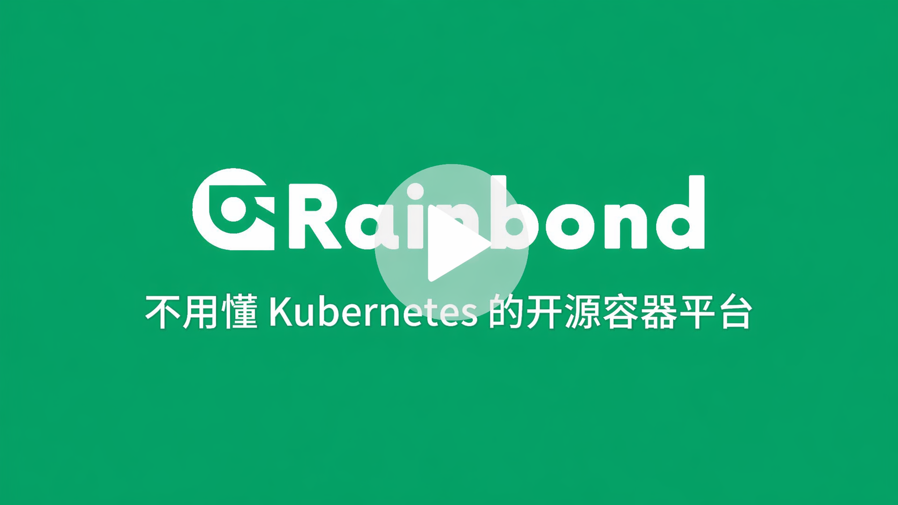

<div align="center">
  

  <p>
    <a href="./README-en.md">English</a>
  </p>

  <p>
    
    
    
  </p>
</div>
<div align="center">

## 不用懂 Kubernetes 的开源容器平台

 <p>
    <a href="https://www.bilibili.com/video/BV1Lzo5BGEuc">
      
    </a>
  </p>

Rainbond 帮助团队在不深入学习 Kubernetes 的前提下完成应用构建、部署、升级、运维与私有化交付。  
更适合私有化部署、离线交付、信创适配、应用市场交付和 AI 应用私有化场景。

**Open-source container platform for teams that want to deploy and run applications without deeply operating Kubernetes.**

[项目官网](https://www.rainbond.com?channel=github) ·
[快速安装](https://www.rainbond.com/docs/quick-start/quick-install?channel=github) ·
[文档](https://www.rainbond.com/docs?channel=github) ·
[选型中心](https://www.rainbond.com/compare?channel=github) ·
[应用市场](https://hub.rainbond.com?channel=github)

</div>

---

## Rainbond 是什么

Rainbond 是一款 `100% 开源`、`不用懂 Kubernetes` 的开源容器平台。  
它更偏向解决“应用交付”问题，而不是只做 Kubernetes 资源管理界面。

如果你的团队正在面对下面这些问题，Rainbond 更值得你看一眼：

- 会 Kubernetes，但应用交付还是很费劲
- 客户环境复杂，每次上线都像重来一遍
- 需要私有化部署、离线交付、信创适配或内网部署
- 想做统一的应用交付入口，但不想从零开始自研平台

---

## 你可能最关心的是哪一类问题

| 你的目标 | 建议先看这里 |
| --- | --- |
| 我想先判断 Rainbond 适不适合我 | [选型中心](https://www.rainbond.com/compare?channel=github) |
| 我想马上装起来试试 | [快速安装](https://www.rainbond.com/docs/quick-start/quick-install?channel=github) |
| 我装完了，想跑第一个应用 | [部署你的第一个应用](https://www.rainbond.com/docs/quick-start/getting-started?channel=github) |
| 我在做离线 / 内网 / 客户现场 / 信创 | [离线 / 信创专题](https://www.rainbond.com/offline-and-xinchuang?channel=github) |
| 我想看能不能通过应用市场一键部署 | [Rainbond 应用市场](https://hub.rainbond.com?channel=github) |

---

## Rainbond 解决什么问题

### 1. 不会 Kubernetes，也能把应用交付起来

Rainbond 通过图形化界面和标准化流程，把源码、镜像、应用模板、依赖关系、访问入口、升级回滚等动作收进同一条应用链路里。

### 2. 让复杂企业环境的交付更稳

Rainbond 更适合：

- 私有化部署
- 内网环境部署
- 离线环境交付
- 国产化信创适配
- x86 到 ARM 迁移验证

### 3. 应用市场和模板化交付

Rainbond 的价值不只在于“把应用跑起来”，还在于：

- 应用模板
- 应用市场
- 一键安装
- 一键升级
- 客户环境复制

### 4. 让应用运维和应用交付围绕“应用”展开

它更强调：

- 应用级抽象
- 应用拓扑与依赖
- 应用升级与回滚
- 应用在多环境、多集群中的交付和运行

---

## 为什么选择 Rainbond

### 低门槛，但不是低能力

Rainbond 不是简单把 Kubernetes “藏起来”，而是把复杂度重新分配：

- 平台和运维团队接住底层能力
- 开发和交付团队围绕应用完成构建、部署、交付和运维

### 更适合复杂企业场景

很多平台更适合管集群。  
Rainbond 更适合解决这些问题：

- 应用怎么交付
- 客户现场怎么复制
- 离线环境怎么升级
- AI 应用怎么私有化部署

### 应用市场与标准化交付能力更强

如果你真正需要的是：

- 模板化交付
- 应用市场复用
- 离线包导出导入
- 版本升级与回滚

Rainbond 的路径会更贴近真实工作。

---

## 与常见平台的差异

| 对比维度 | Rainbond | Rancher / KubeSphere 这类平台 |
| --- | --- | --- |
| 核心侧重点 | 应用交付、应用管理、模板化复用 | 集群治理、平台运维、Kubernetes 管理 |
| 面向用户 | 开发、交付、企业 IT、平台负责人 | K8s 管理员、平台运维、集群治理团队 |
| 最强场景 | 私有化、离线、信创、应用市场、AI 私有化 | 多集群治理、资源管理、平台统一运维 |
| 学习曲线 | 更低，尽量少暴露 K8s 细节 | 需要更理解 K8s 与平台治理 |

如果你正在选型，建议直接看：

- [Rainbond vs KubeSphere](https://www.rainbond.com/compare/rainbond-vs-kubesphere?channel=github)
- [Rainbond vs Rancher](https://www.rainbond.com/compare/rainbond-vs-rancher?channel=github)
- [Rainbond vs Sealos](https://www.rainbond.com/compare/rainbond-vs-sealos?channel=github)

---

## 典型场景

- **不会 Kubernetes 也能做应用交付**
- **AI 应用私有化部署**
- **离线 / 内网环境交付**
- **信创环境应用管理**
- **x86 到 ARM 迁移**
- **企业应用市场与标准化交付**

推荐继续看：

- [离线 / 信创 / 国产化专题](https://www.rainbond.com/offline-and-xinchuang?channel=github)
- [选型中心](https://www.rainbond.com/compare?channel=github)

---

## 快速开始

### 安装要求

- Linux 或 macOS
- 建议至少 2 CPU / 8GB RAM / 50GB 磁盘空间

### 快速安装

执行下面的命令，即可快速体验 Rainbond：

```bash
curl -o install.sh https://get.rainbond.com && bash ./install.sh
```

安装完成后，在浏览器中访问：

```bash
http://<你的IP>:7070
```

### 下一步

1. [快速安装](https://www.rainbond.com/docs/quick-start/quick-install?channel=github)
2. [部署你的第一个应用](https://www.rainbond.com/docs/quick-start/getting-started?channel=github)
3. [查看应用市场](https://hub.rainbond.com?channel=github)

---

## 社区与支持

- [文档中心](https://www.rainbond.com/docs?channel=github)
- [常见问题](https://www.rainbond.com/docs/faq?channel=github)
- [社区支持](https://www.rainbond.com/docs/support?channel=github)
- [GitHub Issues](https://github.com/goodrain/rainbond/issues)

---

## 贡献

如果你想参与贡献，推荐从这些入口开始：

- [贡献指南](https://www.rainbond.com/docs/contribution?channel=github)
- [Rainbond Docs](https://github.com/goodrain/rainbond-docs)
- [提交 Issue](https://github.com/goodrain/rainbond/issues)

欢迎参与：

- 代码贡献
- 文档改进
- 使用经验分享
- 应用模板与插件分享

---

## 相关项目

- [rainbond-console](https://github.com/goodrain/rainbond-console) - 控制台后端
- [rainbond-ui](https://github.com/goodrain/rainbond-ui) - 控制台前端
- [rainbond-operator](https://github.com/goodrain/rainbond-operator) - 安装与运维
- [builder](https://github.com/goodrain/builder) - 源码构建工具集

---

## License

This repository is licensed under the [Rainbond Open Source License](./LICENSE), based on Apache 2.0 with additional conditions.
