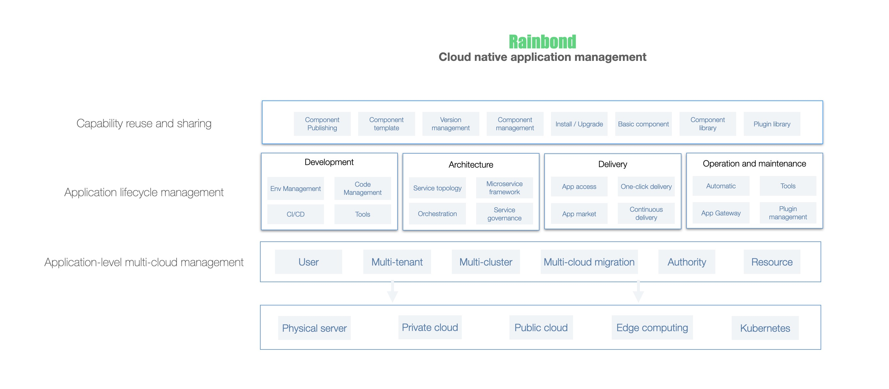

<div align="center">
  

  [](README-zh.md)
  [](https://github.com/goodrain/rainbond/stargazers)
  
  [](https://godoc.org/github.com/goodrain/rainbond)

  <h3>No need to know Kubernetes' cloud native application management platform</h3>

  [Website](https://www.rainbond.com/en?channel=github) • [Documentation](https://www.rainbond.com/en/docs/?channel=github)
</div>

## What is Rainbond ?

Rainbond is 100% open-source, offers a serverless experience, and allows you to easily manage containerized applications without needing to understand Kubernetes. It smoothly transitions to Kubernetes and is an integrated application management platform suitable for private deployment.

### Highlights

- **No Need to Write Dockerfile and Yaml:** The platform supports automatic recognition of multiple programming languages such as Java, Python, Golang, NodeJS, Php, .NetCore, etc. You can complete the build and deployment through a guided process without having to write Dockerfile and Yaml.

- **Modular Assembly:** Business components running on Rainbond can be published as reusable application templates. There is a unified component library storage, and you can achieve the accumulation and reuse of business components through modular assembly.

- **One-Click Installation and Upgrade of Applications:** Hundreds of applications out of the box, and various microservices application templates support one-click installation and upgrade.

- **Comprehensive Observability:** Rainbond provides comprehensive observability, including cluster monitoring, node monitoring, application monitoring, and component monitoring.

- **Application Full Lifecycle Management:** Serverless experience supports full lifecycle management and operation of applications and components, such as startup, shutdown, build, update, automatic scaling, gateway policy management, etc., in a non-intrusive microservices architecture.

### Experience

1. **Turn Your Code into Cloud-Native Applications Without Modification:** Whether it's a new or existing business, your code can be containerized without modification. You don't need to understand technologies like Docker and Kubernetes to deploy applications, and you get all the features of a cloud-native application.

2. **Ordinary Developers Can Perform Application Operations Without Learning:** Through application-level abstraction, ordinary developers can perform application operations based on their understanding of the application's relevant attributes. They can extend monitoring, performance analysis, logging, security, and other operational capabilities through plugins, eliminating the need for dedicated SREs.

3. **Install Cloud-Native Applications Like Installing Mobile Apps:** Various cloud-native applications are stored in the form of application templates in the application marketplace. When integrated with various infrastructure or cloud resources, applications can be used immediately or installed/upgraded with one click.

4. **One-Click Delivery of Complex Applications to Customer Environments:** Complex applications can be released as application templates. When the customer environment is connected to the internet, you can install and run them with one click. If the customer environment is offline, you can export offline application templates, import them into the customer environment, and install and run them with one click.

## Architecture



Rainbond can connect to various private clouds, public clouds, Kubernetes, and other underlying infrastructures. It supports user management, multi-tenancy, multi-cluster management, multi-cloud migration, and allocates and manages resources based on applications, achieving application-centric multi-cloud management.

For developers, there is no need to worry about underlying resources and concepts. Rainbond provides an out-of-the-box platform that supports the full lifecycle management of applications, including development, architecture, delivery, and operation.

Rainbond also wraps and abstracts the entire application, defining an abstract application model. This model includes all the runtime definitions required for application execution and isolates them from underlying technologies and concepts. Developers can reuse and share capabilities based on this model, such as one-click publishing, installation, and upgrade of components.

For more detailed information about the Rainbond architecture, please refer to the [Rainbond Design Concept](https://www.rainbond.com/en/docs/quick-start/architecture/design-concept).

## Getting Started

### Installation

You only need to execute the following command to run a container and quickly experience the full functionality of Rainbond. For more installation options, refer to [Installation and Upgrade](https://www.rainbond.com/en/docs/installation/).

```bash
curl -o install.sh https://get.rainbond.com && IMGHUB_MIRROR=rainbond bash ./install.sh
```

After the command is executed successfully, open a browser and enter `http://<IP>:7070` to access the platform and start deploying applications. `<IP>` is the IP address you selected or entered when running the script.

### Quick Start

Please refer to the [Quick Start](https://www.rainbond.com/en/docs/quick-start/getting-started/?channel=github) documentation.

## Open Source Community

If you encounter any issues while using Rainbond and need help, please refer to the [Community Support](https://www.rainbond.com/en/community/support/).

You can also add the WeChat assistant to join the Rainbond technical discussion group:


Slack: [Rainbond Slack Channel](https://join.slack.com/t/rainbond-slack/shared_invite/zt-1ft4g75pg-KJ0h_IAtvG9DMgeE_BNjZQ)

## Contribution

We welcome contributions and sharing in the Rainbond community in areas such as platform usage experience, standardized applications, and plugin sharing.

If you are a Rainbond user who has a deep understanding of Rainbond and aligns with its technical direction, and you have significant demands within your organization, we welcome you to [contribute to Rainbond](https://www.rainbond.com/en/community/contribution/?channel=github).

## Related Projects

This repository contains the core service implementation code of the Rainbond data center. The project also includes the following sub-projects:

- [Rainbond-Console](https://github.com/goodrain/rainbond-console): Rainbond console server project.
- [Rainbond-Console-UI](https://github.com/goodrain/rainbond-ui): Rainbond console frontend project.
- [Rainbond-Operator](https://github.com/goodrain/rainbond-operator): Rainbond installation and operation project.
- [Rainbond-Cloud-adaptor](https://github.com/goodrain/cloud-adaptor): Rainbond cluster installation driver service.
- [Rainbond-Builder](https://github.com/goodrain/builder): Rainbond source code build toolset.
- [Rainbond-Docs](https://github.com/goodrain/rainbond-docs): Rainbond documentation.

## License

Rainbond follow LGPL-3.0 license, Details see [LICENSE](https://github.com/goodrain/rainbond/blob/main/LICENSE) and [Licensing](https://github.com/goodrain/rainbond/blob/main/Licensing.md).
