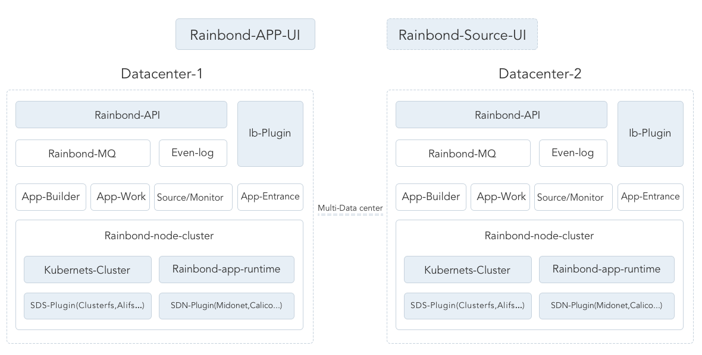

# 云帮


----
云帮是国内第一个开源的企业级应用管理平台(无服务器PaaS)，集CI/CD自动化应用构建系统，原生支持微服务架构的应用管理系统和全自动的计算资源管理系统于一身。是以应用为中心理念的最佳实践。

云帮得益于[Kubernetes](https://github.com/kubernetes/kubernetes),[Docker](https://github.com/moby/moby)等容器生态开源项目，结合好雨云多年的公有云生产运营经验。成为国内理念最新的云应用平台。我们选择开源，拥抱社区。吸收社区最好的想法和实践打造云帮项目，让更多的用户和企业拥抱以应用为中心的云计算平台。

----

## 快速开始

1. [安装云帮数据中心]().
2. [安装云帮应用控制台]().
3. [创建你的第一个应用]().

## 快速构建
如果你想马上构建云帮组件，你有两种方式：   
##### 你有Golang开发环境

```
$go get -d github.com/goodrain/rainbond
$cd $GOPATH/src/github.com/goodrain/rainbond
$make all
```
##### 你有Docker环境

```
$git clone github.com/goodrain/rainbond
$cd rainbond
$make all-image
```
##### BUG提交
使用或者学习云帮过程中遇到BUG，请异步[ISSUES](https://github.com/goodrain/rainbond/issues),首先查找类似BUG及其修复方案，若无类似问题你可以创建Issue。

## [云帮架构]()

### 架构总图   

### 云帮构成
云帮由[云帮数据中心](https://github.com/goodrain/rainbond) [云帮应用控制台](https://github.com/goodrain/rainbond-ui) 云帮资源控制台(企业版提供)构成。并与好雨云市进行无缝对接，实现超融合计算池。    
* [云帮数据中心]()    
云帮数据中心由[一系列分布式组件]()构成，面向资源抽象云帮节点，面向应用抽象存储，网络以及计算资源。本着插件化，分布式，软件定义一切的设计原则，在任何计算环境（公有云，私有云，IDC，行业计算）之上构建统一的应用运行环境。    
* [云帮应用控制台]()    
云帮应用控制台是一个Web控制台，对接多个云帮数据中心，提供应用的全生命周期管理功能。    

## 社区支持
### 云帮用户交流群：
- 477016432(1群)  
- 453475798(2群)  
- 419331946(3群)

### 云帮微信群
> 云帮小秘书可以拉您进云帮微信群：


### 文档支持
- [云帮开发文档](http://doc.goodrain.com/cloudbang-community-install/247616)
- [安装文档](http://doc.goodrain.com/cloudbang-community-install/247616)
- [使用文档](http://doc.goodrain.com/usage)
- [平台维护](http://doc.goodrain.com/cloudbang-community-install/215655)
- [企业版功能介绍](http://doc.goodrain.com/cloudbang-enterprise)