# 如何在 Rainbond 使用 KubeBlocks 

## 创建 KubeBlocks 数据库集群

KubeBlocks 数据库集群的创建与常规 Rainbond 组件的创建略有不同，数据库集群并没有常规 Rainbond 组件的构建源检测、端口设置、连接信息设置等操作，而是在完成数据库的相关设置之后直接完成创建，Rainbond 会自动完成端口和连接信息的设置 

### 通过创建入口进入数据库集群的创建流程

当你安装了 Block Mechanica 和 KubeBlocks 并且存在至少一个可用的 KubeBlocks Addon（你可以创建的数据库集群的类型）时，就能够在 Rainbond 选择组件创建方式的页面中看到 `创建数据库集群` 的入口

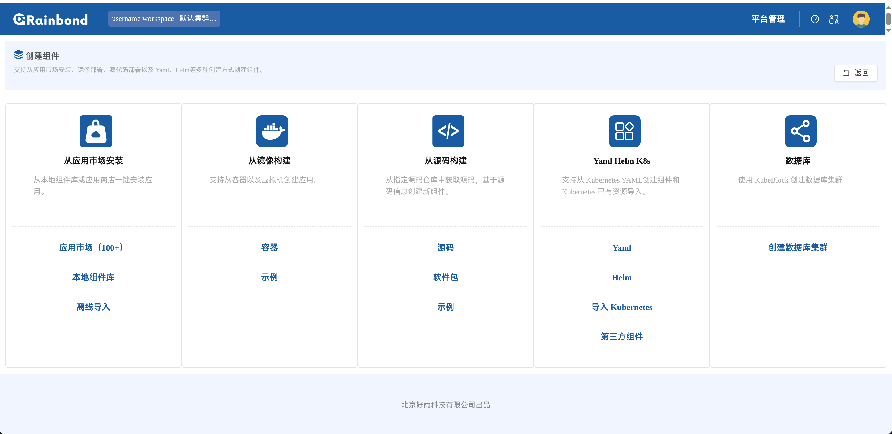

如果不显示数据库创建的入口：
检查 Block Mechanica 是否正常运行并且确保至少存在一个 Block Mechanica 支持的 KubeBlocks Addon 为 `Enabled` 状态，Block Mechanica 目前支持：`MySQL`, `PostgreSQL`, `Redis`, `RabbitMQ`

```shell
# 查找是否存在可用的 Block Mechanica Pod
kubectl get pod -n rbd-system

# 查找 KubeBlocks Addons
kubectl get addons.extensions.kubeblocks.io
```

### 数据库集群创建流程

设置数据库集群名称并选择数据库类型

当前 MySQL 使用的 topology 为 [semisync](https://kubeblocks.io/docs/release-1_0_1/kubeblocks-for-mysql/03-topologies/01-semisync)，Redis 使用 [replication](https://kubeblocks.io/docs/release-1_0_1/kubeblocks-for-redis/03-topologies/02-replication)

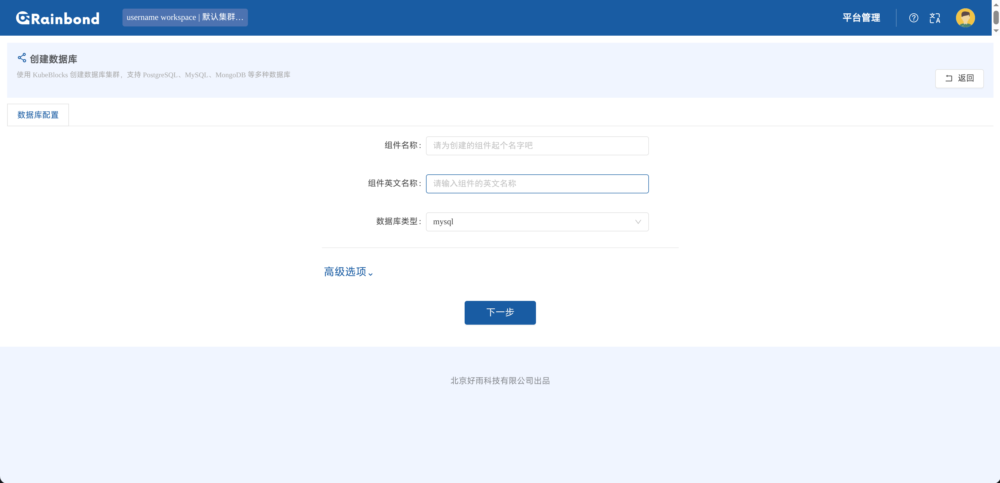

用户可以为数据库集群设置资源分配等基础信息，对于支持备份的数据库类型，将会提供备份设置，当用户选定 backuprepo 之后将会启用备份功能并开启周期自动备份

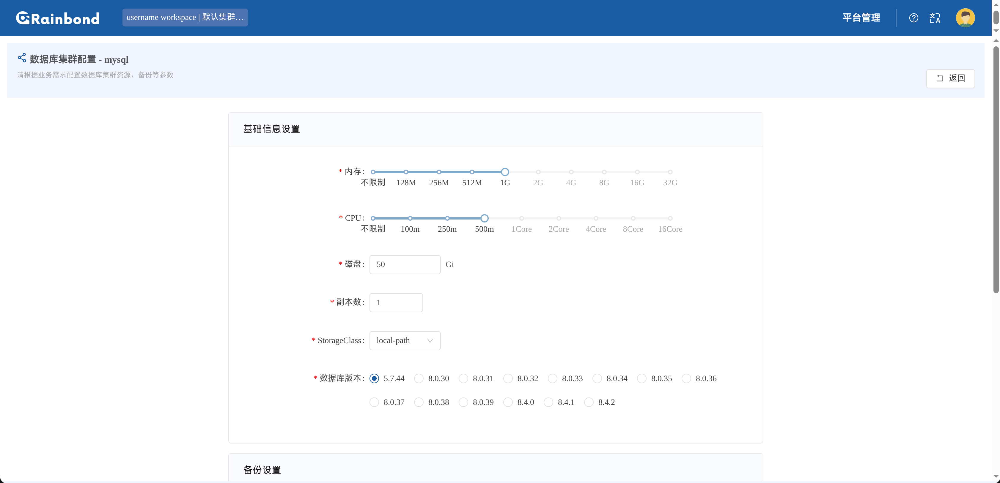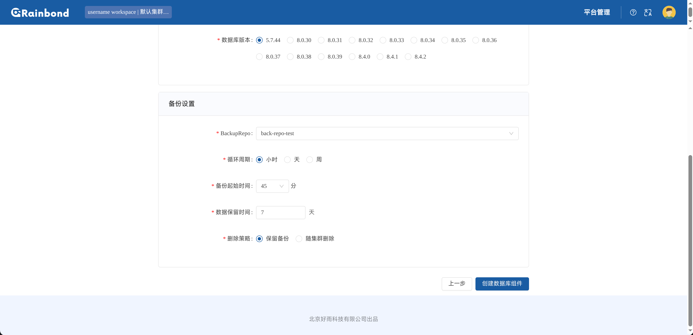

几点说明：

1. 对于多 component 结构的 Cluster 比如 Redis (sentinel & redis)，会使用相同的资源分配设置，当用户对数据库集群进行伸缩时，Block Mechanica 会尽最大努力的保证这一点

2. [StorageClass](https://kubernetes.io/zh-cn/docs/concepts/storage/storage-classes/) 会影响到数据库集群的储存容量扩容功能，只有当 StorageClass 的 `ALLOWVOLUMEEXPANSION` 为 `true` 时，扩容功能才能正常生效。该选项在完成数据库集群创建之后**不可修改**

   ```shell
   kubectl get storageclass
   ```

3. 对于备份设置，只有手动为数据库集群选定了使用的 BackupRepo 时才会被启用，对于不支持备份的数据库如 RabbitMQ 则不会显示这一选项卡

4. 如果 BackupRepo 一栏为空，请确保集群中存在至少一个 backuprepo 且 status 为 `Ready`
   ```shell
   kubectl get backuprepo
   NAME                    STATUS   STORAGEPROVIDER   ACCESSMETHOD   DEFAULT   AGE
   kubeblocks-backuprepo   Ready    minio             Tool           true      22d
   ```

**在完成上述的一系列设置之后，点击 `创建数据库组件` 之后即可完成组件创建**

## 数据库集群运维

与常规的 Rainbond 组件不同，数据库集群的状态由 KubeBlocks 进行管理，Rainbond 只负责将用户的操作转发给 Block Mechanica 并由 Block Mechanica 通过 k8s API 让 KubeBlocks 完成数据库集群的运维操作。

数据库集群运维的绝大部分内容与常规的 Rainbond 组件一致，但是不支持 `日志`、`环境配置` 选项卡，除此之外不同的部分将在下面一一说明：

### 总览

对于数据库集群的状态，与常规 Rainbond 组件不同的是，**只有**当数据库集群进入 `运行中` 时，才能正常使用，详见 [KubeBlocks 文档](https://kubeblocks.io/docs/release-1_0_1/user_docs/references/api-reference/cluster#apps.kubeblocks.io/v1.ClusterPhase)

对于 KubeBlocks 在 Rainbond 中操作记录功能的实现，受限于 KubeBlocks 与 Rainbond 的集成方式，目前对于数据库集群的部分运维操作基于 KubeBlocks 在对于具体的数据库集群进行运维时使用的 OpsRequest 实现，故对于部分不通过 OpsRequest 进行的运维操作则无法展示，如 `备份` 选项卡中的备份设置的修改、备份的删除操作。

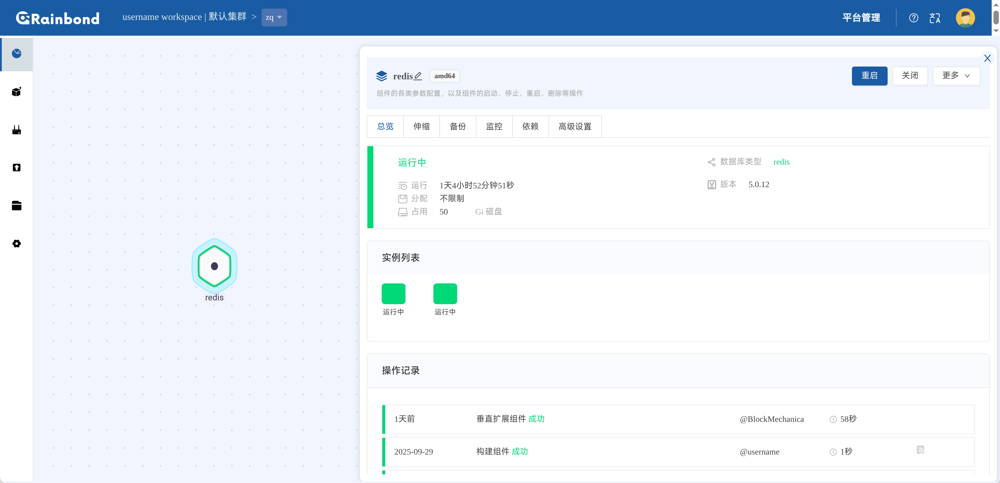


### 伸缩

KubeBlocks 在 Rainbond 中不支持 `自动伸缩` 、各个实例资源占用的实时展示和伸缩记录

对于用户进行的伸缩操作，Block Mechanica 会为其创建一个 OpsRequest 用于实现数据库集群的伸缩。储存容量的扩容需要在创建数据库集群时设置的 StorageClass 支持扩容才能生效

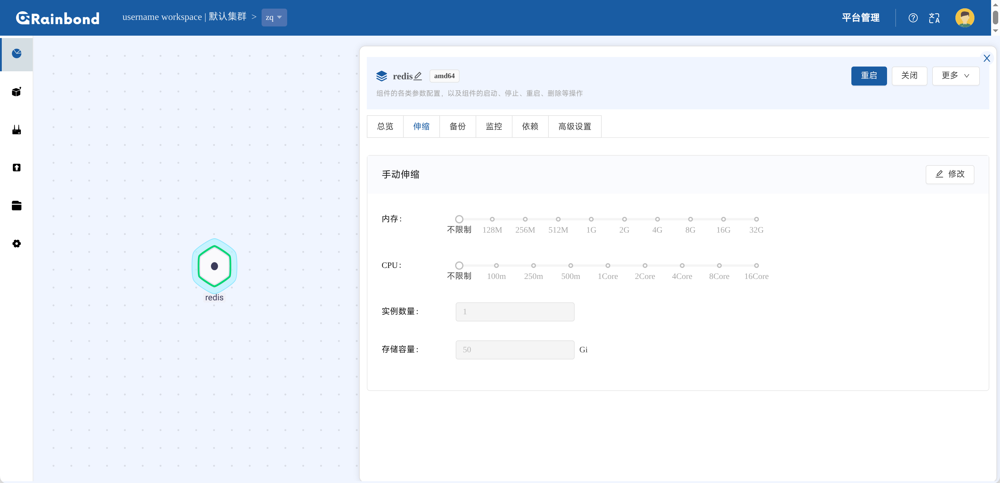

### 备份

只有当用户为数据库集群设置了 BackupRepo 之后才能够正常的进行手动备份，当前暂时无法单独启用手动备份或者自动备份

用户能够通过备份列表中进入 `Completed` 的备份恢复数据库集群，从备份恢复数据库集群将会基于此备份创建一个**新的数据库集群**

对于备份设置的修改和已有备份的删除，**KubeBlocks 不支持通过 OpsRequest 完成**，故不会在 `总览` 的 `操作记录` 中展示

对于不支持备份操作的数据库类型，如 RabbitMQ，将无法在此处进行任何操作

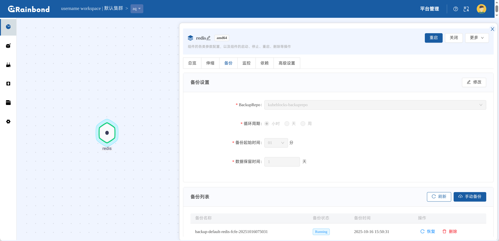

### 监控

目前 Rainbond 中只支持对于数据库集群的 `资源监控`

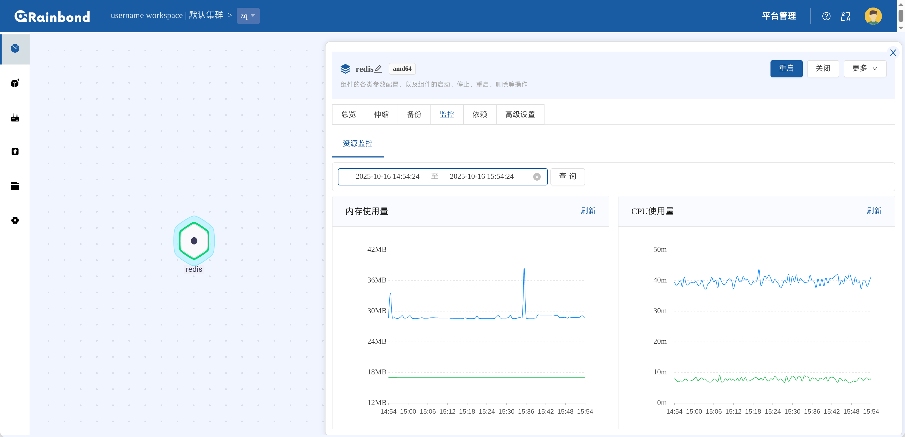 

### 依赖

Rainbond 将在完成数据库集群创建之后自动在组件连接信息中添加数据库的默认用户和密码

这部分的组件连接信息的使用与常规 Rainbond 组件的[使用方法](https://www.rainbond.com/docs/how-to-guides/app-ops/dependon)一致

数据库集群在 Rainbond 中不支持将其他 Rainbond 组件添加为依赖的操作，移除了 `依赖外部组件` 选项卡

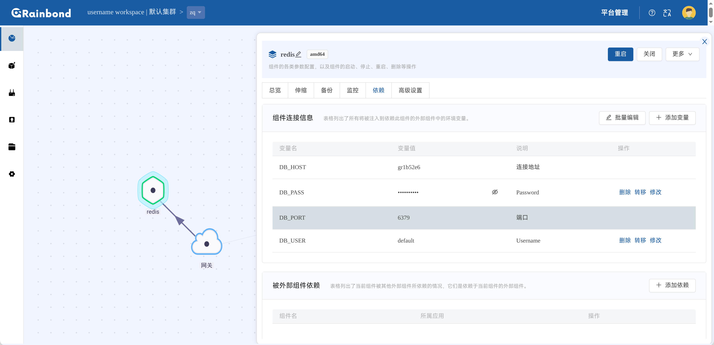

### 高级设置

相比于常规的 Rainbond 组件，KubeBlocks 数据库集群不支持高级设置中的 `储存`、`插件`、`构建源`、`其他设置`，但是额外支持了 `参数配置`，对于支持数据库参数配置的类型，可以在此处设置数据库参数，此外并不是所有的数据库类型都支持参数配置，如 RabbitMQ

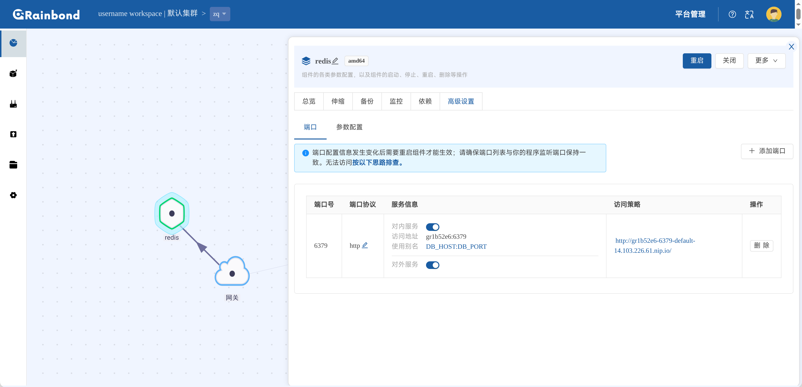

#### 端口

对于端口设置，目前 KubeBlocks 数据库集群仅支持 TCP 协议

#### 参数配置

对于数据库参数的修改，Rainbond 和 Block Mechanica 只对用户输入的值做最低限度的校验，具体成功与否取决于 KubeBlocks OpsRequest 的执行结果，请参考各个数据库类型的官方文档进行修改

如果该数据库类型不支持进行参数配置，则该表将显示为空

Block Mechanica 判断可展示的数据库参数和其当前值的逻辑为：
从对应数据库的 `parametersdefinitions.parameters.kubeblocks.io` 中获取定义，并从数据库集群创建时对应创建的 configmap 中获取配置文件中设置的值（对应 `redis.conf`, `postgresql.conf`, etc.），对二者**取交集**作为在 Rainbond 中展示的数据

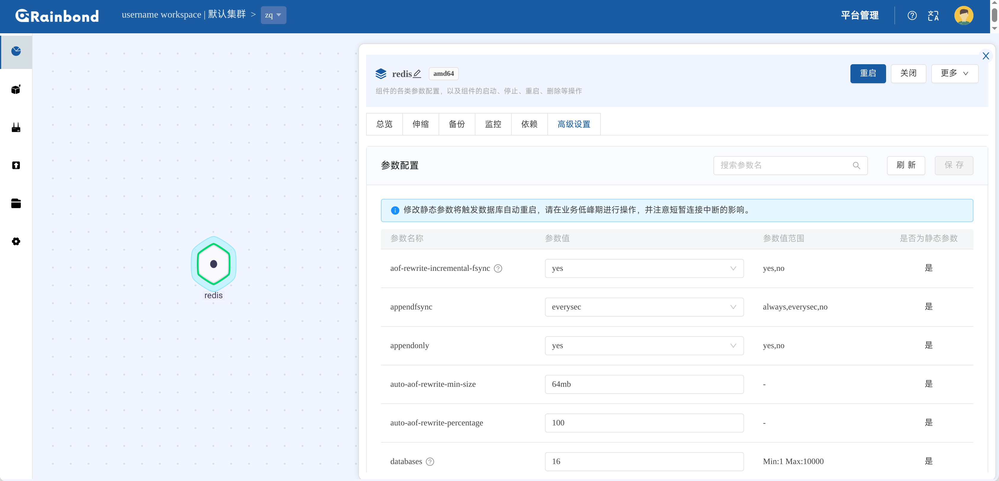

### 其他

与常规 Rainbond 组件不同，数据库集群不支持 `构建`、`更新(滚动)`、`访问`、`Web终端` 按钮，对于手动访问数据库进行设置一类的操作，KubeBlocks 的文档中更加推荐通过 service 进行访问

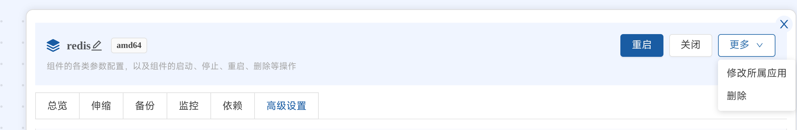

**KubeBlocks 数据库集群目展示前支持的功能有限，除去前面明确说明的部分，部分 Rainbond 功能可能因为各种原因不被支持，如由于 Rainbond 与 KubeBlocks 的设计差异，构建、滚动更新操作将不会得到支持；在 Rainbond 的团队空间中的储存分配量并不会计算为 KubeBlocks 数据库集群分配的储存量；以目前 KubeBlocks 在 Rainbond 中的集成度，`应用模板` 及其相关功能暂不被支持**

