# 设计文档 && 技术文档：KubeBlocks 在 Rainbond 中的集成

## 1. 目标与业务流程

### 1.1 目标

提供与 Rainbond 组件使用**体验一致**的图形化 KubeBlocks 数据库集群创建与运维操作

允许用户通过 Rainbond 图形化创建 KubeBlocks 数据库集群，同时拥有与 Rainbond 组件基本一致的使用体验

### 1.2 业务流程

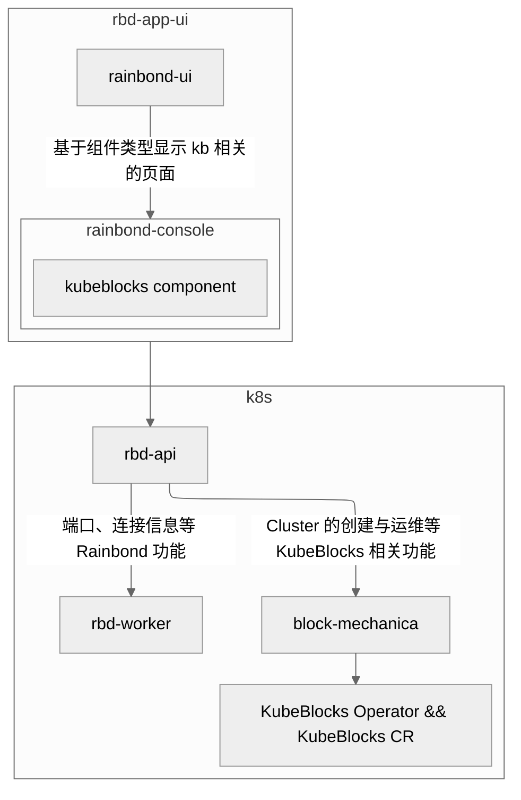


用户对 KubeBlocks workload 进行的各种运维操作将被 rbd-api 转发给 Block Mechanica，**由 Block Mechanica 负责 KubeBlocks 数据库集群具体 workload 的运维相关操作**

## 2. 架构设计

### 2.1 Block Mechanica

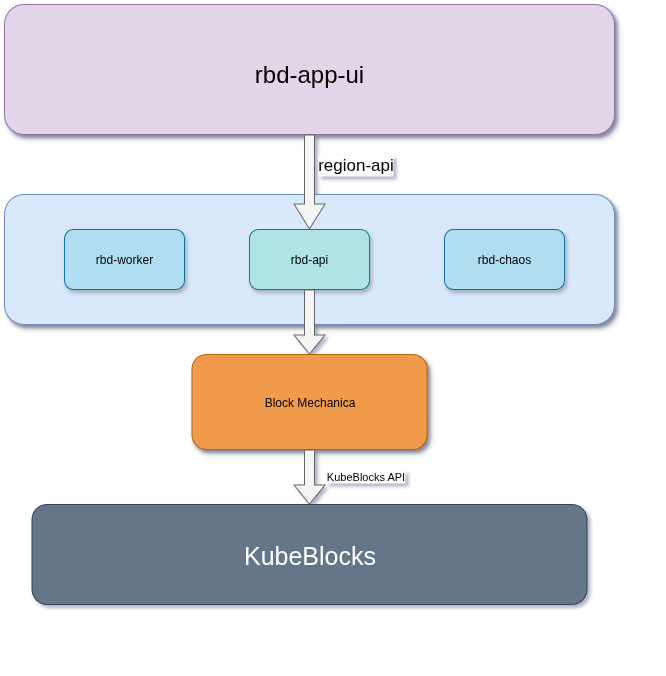

Block Mechanica 负责执行对 KubeBlocks Cluster 实际 workload 的运维与创建操作，而涉及到将 KubeBlocks Cluster 暴露给其他 Rainbond 组件的内容则仍然交由 Rainbond 进行管理

Block Mechanica 通过 Echo 构建的 API 服务接收转发自 rbd-api 的相关请求，在涉及到 KubeBlocks 相关 CR 的 watch 操作时，Block Mechanica 相当于 KubeBlocks 与 Rainbond 之间的适配器，将 watch 到的信息转换成 Rainbond 使用的形式

### 2.2 Rainbond 组件与 KubeBlocks Cluster 之间的桥梁：`KubeBlocks Component`

`KubeBlocks Component` 为新增的 Rainbond 组件类型，用于实现 Rainbond 组件对 KubeBlocks Cluster 的集成，Rainbond 只负责 `KubeBlocks Component` 在 Rainbond 中的连接信息、端口设置、资源监控，其他对于具体 workload 的运维操作将会调用 Block Mechanica API 通过 Block Mechanica 调用 KubeBlocks API 进行运维操作

`KubeBlocks Component` 与 KubeBlocks Cluster 之间通过 `label.service_id` 进行关联

## 3. 功能与界面

### 3.1 功能设计	

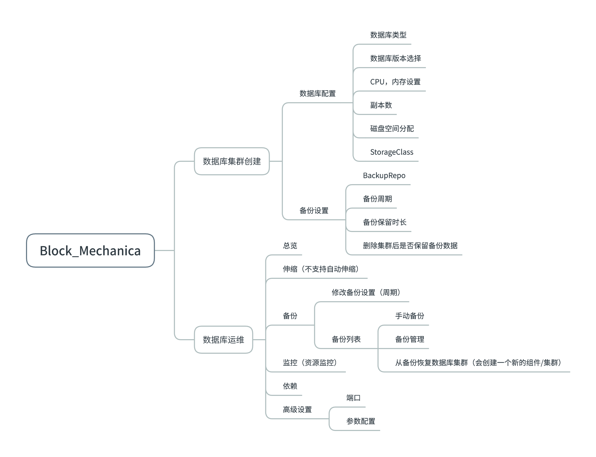

### 3.2 界面与交互

在安装了 Block Mechanica 之后，在创建组件页面会额外提供创建数据库的入口

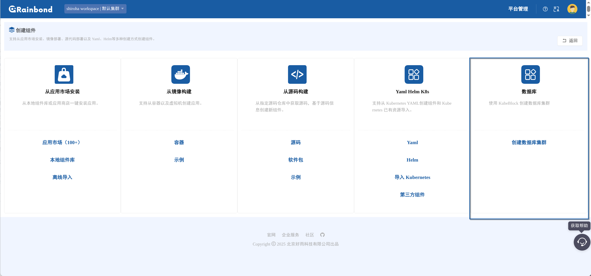

用户将能够通过此入口进入数据库集群的创建界面，UX 上将延续 Rainbond 创建组件的流程

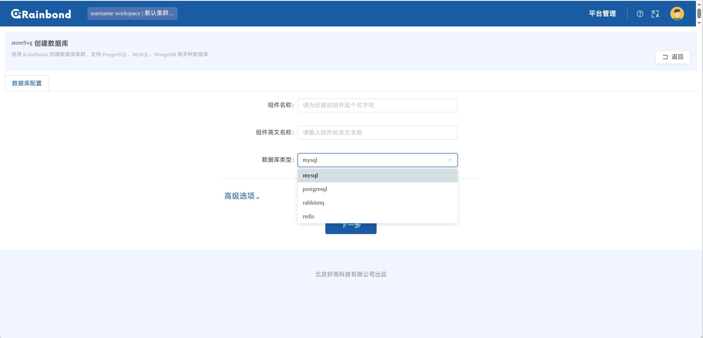

用户能够配置数据库集群的资源分配、storageclass、版本，对于支持备份的数据库类型，还能够通过选择备份使用的 backuprepo 来启用备份功能，可以设置定时备份规则

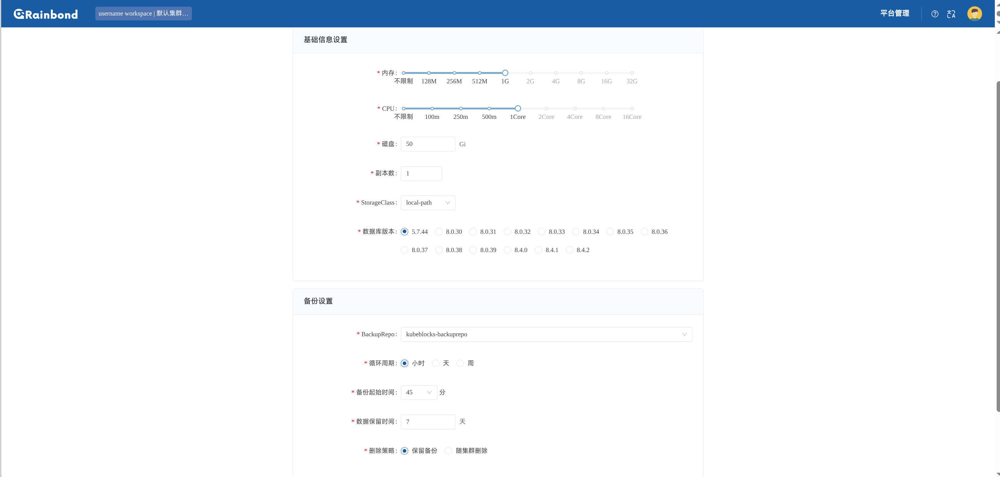

与常规 Rainbond 组件不同的是，KubeBlocks 数据库集群在这一步之后将会开始创建，并设置好端口和连接信息，不需要再额外手动设置。对于某些数据库拓扑，可能需要等待一段时间待储存数据库连接信息的 secret 被创建好之后才能完成 Rainbond 中数据库集群的创建

KubeBlocks 数据库集群在 Rainbond 中作为 `kubeblocks_component` 类型的组件通过插件 `block-mechanica` 进行集成，在使用逻辑上与常规 Rainbond 组件略有不同。对于多组件结构的 KubeBlocks Cluster，所有副本（pod）都将一起展示在实例列表中，伸缩时各个组件使用相同的资源分配；`kubeblocks_component` 不支持构建、版本管理、web 终端、外部访问、日志、自动伸缩、环境配置，`监控` tab 中只支持资源监控，`高级设置`只支持`端口`。同时新增两个 tab：备份、高级设置->参数配置

KubeBlocks 中的运维操作除修改备份设置以外均使用 **KubeBlocks OpsRequest** 进行完成，运行逻辑与 Rainbond 原生组件不同，除去生命周期管理相关的 OpsRequest/操作，都需要在组件进入 `运行中` 状态时才能正常运行

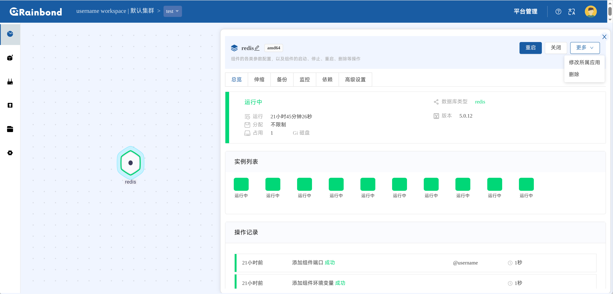

存储容量仅支持扩容，且需要在创建数据库时选择的 `storageclass`  `ALLOWVOLUMEEXPANSION` 为 true

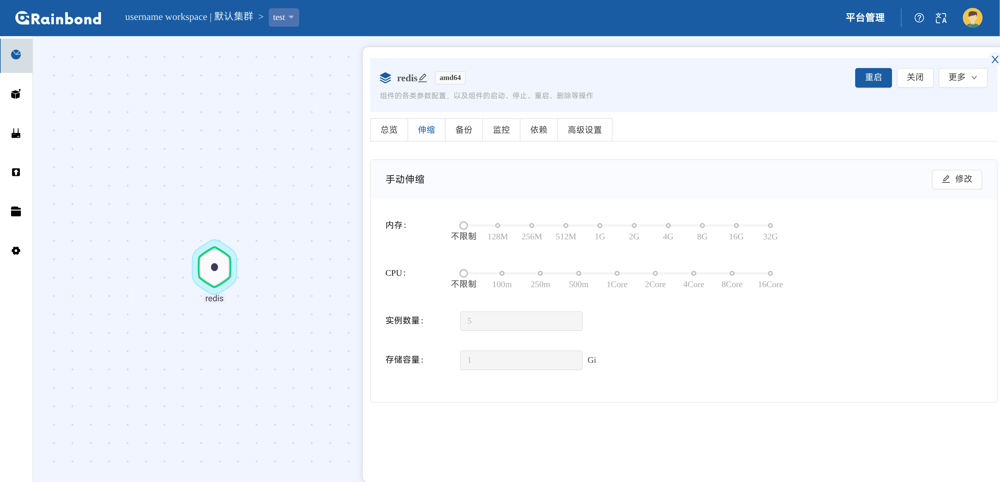

从备份恢复数据库时，会创建一个新的 `kubeblocks_component`

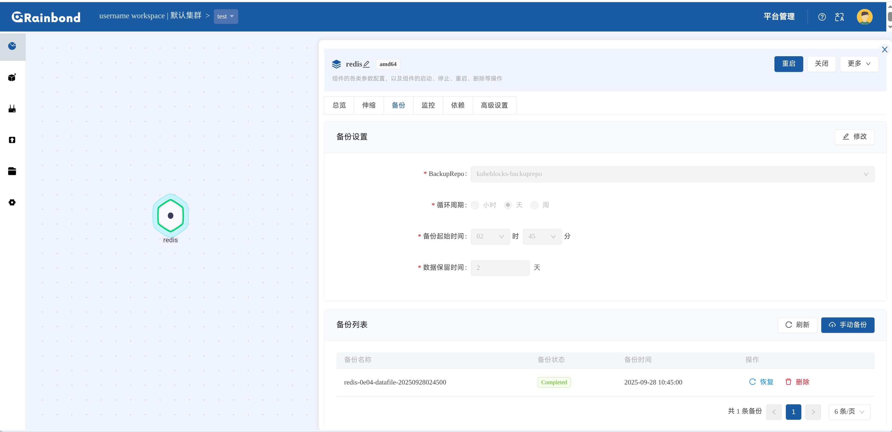

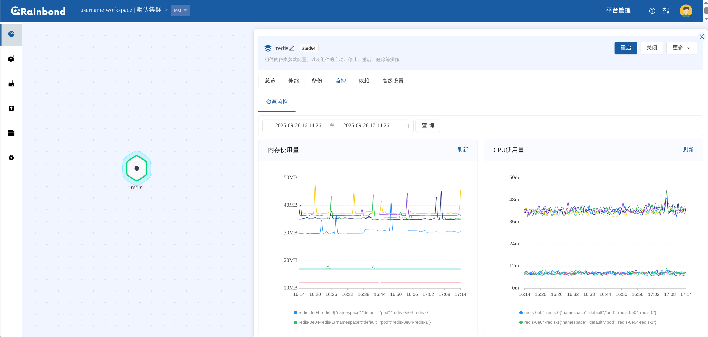

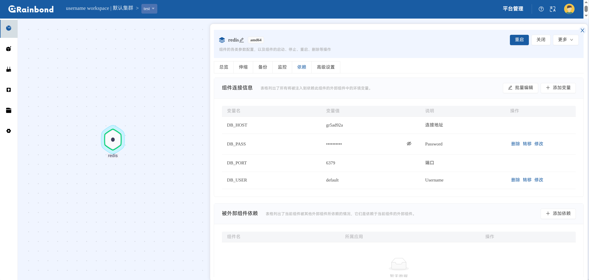

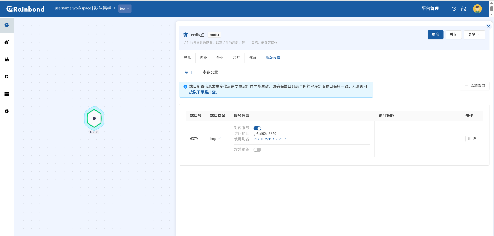

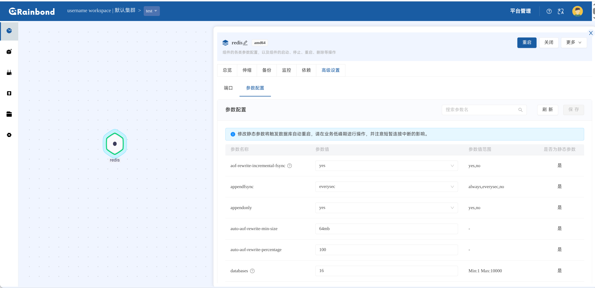

## 4. 技术细节

### 4.1 新组件类型 `kubeblocks_component`

为了实现 KubeBlocks 在 Rainbond 中的集成，我们在 Rainbond 中新增组件类型 `kubeblocks_component`，该类型只向数据库（rbd-db）中写入基础的组件信息、端口和组件连接信息，只由 rbd-worker 创建 service，其余生命周期相关的操作在 rbd-worker 中直接跳过，均由 rbd-api 转发给 Block Mechanica 实现

`kubeblocks_component` 通过 rbd-worker 在进行 `Rainbond 应用 -> k8s 资源` 时为其应用不同的 service selector 创建规则实现通过 `kubeblocks_component` 对于 KubeBlocks Cluster 的连接:

```go
// generateKubeBlocksSelector generate kubeblocks selector
func (a *AppServiceBuild) generateKubeBlocksSelector() map[string]string {
	var (
		peer = map[string]bool{
			"rabbitmq": true,
		}
		clusterName   = "cluster-name"
		componentName = "component-name"
	)

	// get k8s_component_name from database
	if a.service != nil && a.service.K8sComponentName != "" {
		k8sComponentName := a.service.K8sComponentName
		lastDashIndex := strings.LastIndex(k8sComponentName, "-")
		if lastDashIndex != -1 && lastDashIndex < len(k8sComponentName)-1 {
			clusterName = k8sComponentName[:lastDashIndex]
			componentName = k8sComponentName[lastDashIndex+1:]
		}
	}

	selector := map[string]string{
		"app.kubernetes.io/instance":        clusterName,
		"app.kubernetes.io/managed-by":      "kubeblocks",
		"apps.kubeblocks.io/component-name": componentName,
	}
	if _, ok := peer[componentName]; !ok {
		selector["kubeblocks.io/role"] = "primary"
	}

	return selector
}
```

为兼容 selector 创建，用户在 Rainbond 中创建的 KubeBlocks Component 英文名将强制添加后缀 `**-{component}**（即用户选择的数据库类型）

**可以这么认为：对于 Rainbond 来说，KubeBlocks Component 并不会通过 rbd-worker 转换成 KubeBlocks Cluster，而只是一个管理了一个 service，Rainbond 组件通过这个 service 连接到数据库，在事实上完成了常规的 Rainbond 组件的功能；而生命周期相关的管理仍交由 Block Mechanica 完成**

在此设计下，通过 Rainbond 创建的数据库集群的可用性由 KubeBlocks 保障，Block Mechanica 只负责作为 Rainbond 与 KubeBlocks 之间的连接器

### 4.2 KubeBlocks Component 和 KubeBlocks Cluster 的关联是如何实现的

KubeBlocks Cluster 在创建的时候会被添加上与 `kubeblocks_component` 相同的 `service_id` 标签。每个 `kubeblocks_component` 的 `service_id` 都唯一对应一个 KubeBlocks Cluster，Block Mechanica 通过这个 `service_id` 来找到对应的 KubeBlocks Cluster 进行运维操作

### 4.3 Adapter 模式

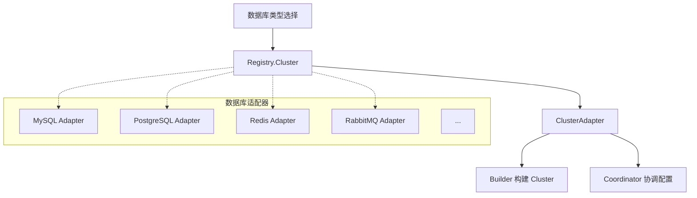

- **统一接口**
  - 通过 `ClusterAdapter` 为不同数据库提供统一的创建接口
  - 每个数据库类型实现自己的 `Builder` 和 `Coordinator`

- **职责分离**
   - `Builder`: 负责构建 KubeBlocks Cluster
   - `Coordinator`: 负责数据库特定的配置协调（端口、认证、备份等等）

- **扩展数据库支持**
  1. 实现 `Builder` 和 `Coordinator`
  2. 在 Registry 中注册
  3. 自动获得完整的集群管理能力

### 4.4 从备份恢复

用户在 Rainbond 中从备份恢复集群时，会先在 Rainbond 中创建一个新的 `kubeblocks_component`，然后通过 Block Mechanica 创建 KubeBlocks OpsRequest 来恢复集群，并将其与新的 `kubeblocks_component` [关联](#42-kubeblocks-component-和-kubeblocks-cluster-的关联是如何实现的)起来

### 4.5 Parameter 配置

KubeBlocks 提供了 `parametersdefinitions.parameters.kubeblocks.io` 来定义数据库的可用参数和约束，Block Mechanica 会通过 [mergeEntriesAndConstraints](../service/cluster/parameter.go) 合并来自 KubeBlocks 的参数约束和通过 `configmap` 中数据库配置文件获取到的参数，作为最后暴露给用户的可配置数据库参数