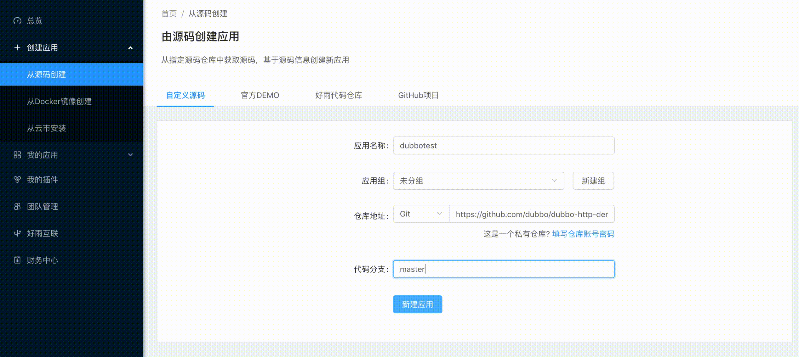
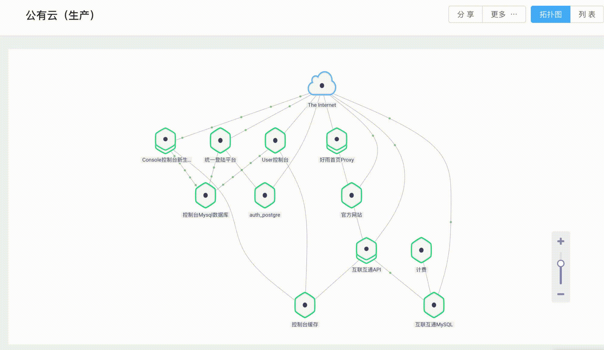

[网站](http://www.rainbond.com) • [文档](https://www.rainbond.com/docs/stable/) • [公有云](https://console.goodrain.com) • [README in English](https://github.com/goodrain/rainbond/blob/master/README.md)

**Rainbond**是以应用为中心的 PaaS，领先的理念和完整的生态源自于不断的验证和优化。

Rainbond 深度整合基于 Kubernetes 的容器管理、Service Mesh 微服务架构最佳实践、多类型 CI/CD 应用构建与交付、多数据中心资源管理等技术，为用户提供云原生应用全生命周期解决方案，构建应用与基础设施、应用与应用、基础设施与基础设施之间的互联互通，满足支撑业务高速发展所需的敏捷开发、高效运维和精益管理需求，赋予企业快速将已有应用 SaaS 化，服务化转型的能力。

## 功能特性

- 集成 Kubernetes 的应用编排与调度系统
- 以应用为中心的的产品设计
- 作为建设云原生数据中心的基础系统
- 支持各类(SpringCloud、Dubbo、API-Gateway)微服务架构应用部署
- 基于扩展式 ServiceMesh 的服务网格系统提供原生微服务治理支持（服务发现、动态路由、限流与熔断）
- 支持多种(HTTP、Mysql、PostgraSQL)类型协议的业务级应用性能分析
- 支持基于源代码（Java、PHP、Python、Golang、Ruby 等）构建应用
- 支持基于私有 Git 仓库、Github 等公有仓库的应用持续构建和部署
- 支持基于 Docker 容器镜像、Docker-Run 命令、DockerCompose 文件智能快捷构建应用
- 支持应用组级全量备份与恢复，跨租户或跨数据中心迁移应用（业务）组。
- 数据中心插件化支持部署不同的负载均衡、SDN 网络、各类型存储系统
- 应用插件体系支持，灵活扩展应用附属功能，例如：日志处理、防火墙、流量分析等
- 公有、私有应用市场支持，完善的应用分享体系
- 多数据中心、跨数据中心应用调度部署
- 管理节点（平台服务）高可用支持
- 计算集群自动化管理与运维，按需伸缩，全面的节点与集群监控

## 快速开始

1.  [安装 Rainbond](https://www.rainbond.com/docs/stable/getting-started/before-installation.html)
2.  [创建第一个应用](https://www.rainbond.com/docs/stable/user-manual/create-an-app.html)
3.  [搭建 ServiceMesh 微服务架构](https://www.rainbond.com/docs/stable/microservice/service-mesh/overview.html)

## 架构

## Roadmap

点击查看 Rainbond 版本开发计划 [Roadmap](http://www.rainbond.com/docs/stable/architecture/roadmap.html)

## 产品图示

- 源码构建示意图

- 应用流量拓扑示意图

## 参与贡献

阅读[CONTRIBUTING](https://github.com/goodrain/rainbond/blob/master/CONTRIBUTING.md)了解如何参与贡献。

## 社区

- 微信：添加微信号 "**zqg5258423**" 并接受邀请入群
- Stack Overflow: https://stackoverflow.com/questions/tagged/rainbond

## License

Rainbond 遵循 LGPL-3.0 license 协议发布，详情查看[LICENSE](https://github.com/goodrain/rainbond/blob/master/LICENSE)及[Licensing](https://github.com/goodrain/rainbond/blob/master/Licensing.md)。

## 鸣谢

感谢以下开源项目

- [Kubernetes](https://github.com/kubernetes/kubernetes)
- [Docker/Moby](https://github.com/moby/moby)
- [Heroku Buildpacks](https://github.com/heroku?utf8=%E2%9C%93&q=buildpack&type=&language=)
- [OpenResty](https://github.com/openresty/)
- [Calico](https://github.com/projectcalico)
- [Midonet](https://github.com/midonet/midonet)
- [Etcd](https://github.com/coreos/etcd)
- [Prometheus](https://github.com/prometheus/prometheus)
- [GlusterFS](https://github.com/gluster/glusterfs)
- [Ceph](https://github.com/ceph/ceph)
- [CockroachDB](https://github.com/cockroachdb/cockroach)
- [MySQL](https://github.com/mysql/mysql-server)
- [Weave Scope](https://github.com/weaveworks/scope)
- [Ant Design](https://github.com/ant-design/ant-design)

## 加入我们

[非常欢迎热爱技术的你加入我们](https://www.rainbond.com/docs/recruitment/join.html)
